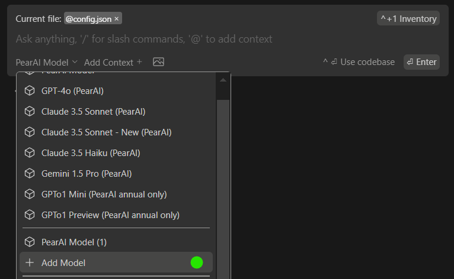
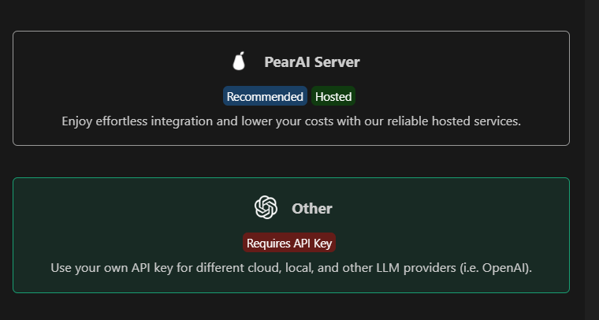
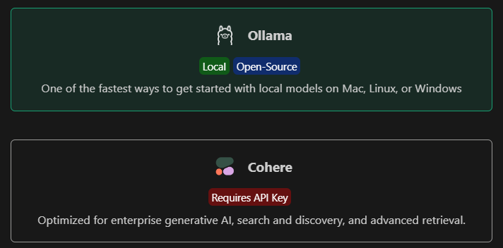

Aside from the built-in models with PearAI, you can follow these steps to add your own models/api keys.

---

1. Open the add model section in PearAI.

   

2. Select "Other" 

   

3. Then choose whichever model you'd like to add.

   

4. Follow the on-screen instructions to complete the setup

Note:
- Add the added models' configuration can be found in the PearAI `config.json` file (`CMD/CTRL+SHIFT+P` > `Open config.json`).
- For Azure OpenAI, the "engine" field is your deployment name.