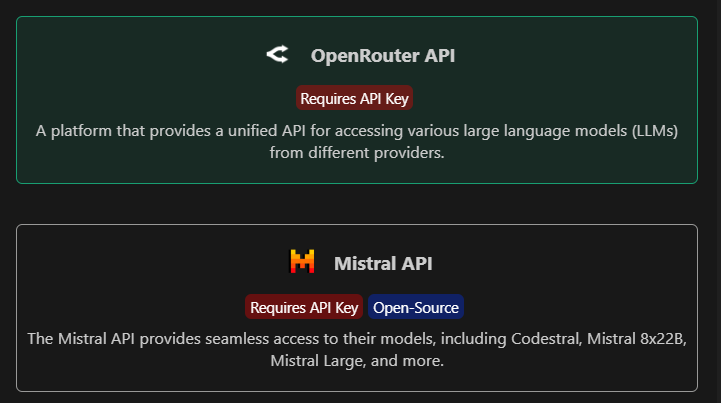

Follow these steps to integrate models like Ollama and OpenRouter into PearAI.

---

## How to Use Ollama with PearAI

### Method 1: Update `config.json`

1. Open the PearAI `config.json` file.
2. Add the model to the `models` array:

   ```json
   "models": [
     {
       "name": "startcoder2",
       "provider": "ollama",
       "version": "latest"
     }
   ]
   ```

3. Save and Reload:
   Save the file, and PearAI will automatically recognize the new model.

### Method 2: Using the Add Model Feature

1. Open the Add Model section in PearAI.
   

2. Select **Other**
   

3. Then choose **Ollama**.
   

4. #### Follow the on-screen instructions to complete the setup

---

## How to Use OpenRouter with PearAI

### Step 1: Obtain an API Key

1. Register at OpenRouter and generate an API key.

### Step 2: Use the Add Model Feature

1. Open the Add Model section in PearAI.
   

2. Select **Other**,
   

3. Then choose **OpenRouter**.
   

4. Follow the on-screen instructions to complete the setup.
