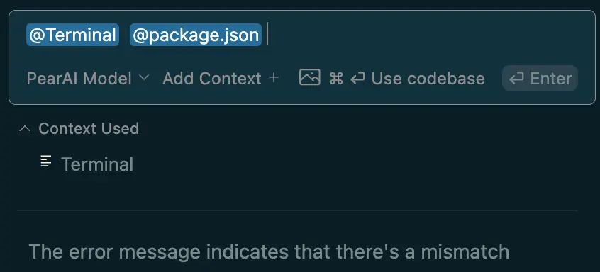

# 🗃️ "`@`" Commands

## How it works

`@` Commands provide extra context (i.e. extra information) that can be included with your prompt to give the LLM more awareness of your work environment. To use this, type '@' inside the PearAI chat to see a dropdown containing a list of context options. Each context provider is a plugin, allowing you to reference an extra piece of information.

As an example, you are having trouble running an app locally, and there's a bunch of errors in the terminal. You can use `@terminal` to include the error logs and further use `@files` to include `package.json` to immediately start debugging the problem. PearAI streamlines the debugging process by allowing you to gather a complete context all in one place.

    !

## Built-in Context Providers

PearAI comes with a few useful context providers ready to use out of the box. If you wish to remove or add context providers, you can do so in `config.json`, under the `contextProviders` list.

### `@Files`

Allows you to specify a file as context. 

```json
{
  "contextProviders": [
    {
      "name": "files"
    }
  ]
}
```
### `@Codebase`

Allows you to provide the codebase as context. Please note that depending on the size of your codebase, this may consume a lot of credits. 

```json
{
  "contextProviders": [
    {
      "name": "codebase"
    }
  ]
}
```
### `@Code`

Allows you to specify functions/classes. 

```json
{
  "contextProviders": [
    {
      "name": "code"
    }
  ]
}
```
### `@Docs`

Allows you to specify a documentation site as context.

```json
{
  "contextProviders": [
    {
      "name": "docs"
    }
  ]
}
```
### `@Git Diff`

This provides as context all the changes you've made on the current branch in reference to main. Use this to get a summary of your current work or to get a code review. 

```json
{
  "contextProviders": [
    {
      "name": "diff"
    }
  ]
}
```
### `@Terminal`

Add your current terminal content as context. 

```json
{
  "contextProviders": [
    {
      "name": "terminal"
    }
  ]
}
```
### `@Problems`

Adds the problems in your current file as context. 

```json
{
  "contextProviders": [
    {
      "name": "problems"
    }
  ]
}
```
### `@Folder`

Reference everything within the specified folder as context. 

```json
{
  "contextProviders": [
    {
      "name": "folder"
    }
  ]
}
```

### `@Directory Structure`

Provides the project's directory structure as context. You can use this context to let the LLM know of any changes you've made to the directory. 

```json
{
  "contextProviders": [
    {
      "name": "directory"
    }
  ]
}
```
