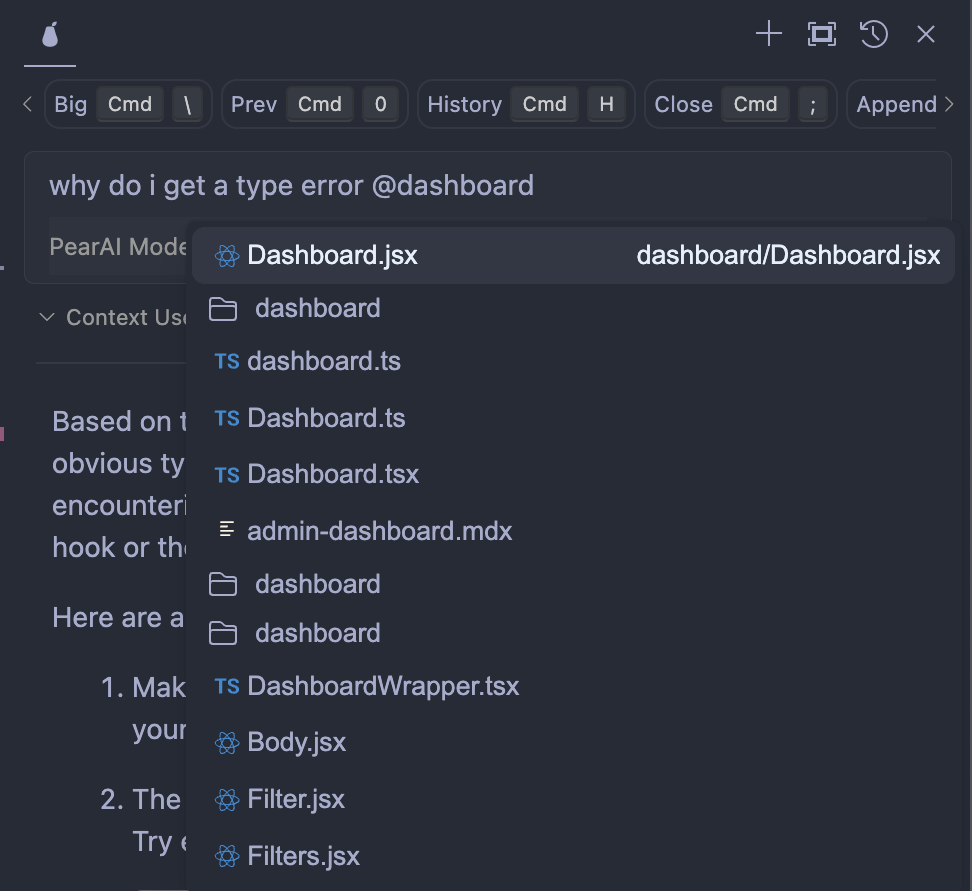

# Context Providers

## How does it work

Context Providers allow you to type '@' and see a dropdown of content that can all be fed to the LLM as context. Every context provider is a plugin, which means if you want to reference some source of information that you don't see here, you can request (or build!) a new context provider.

As an example, you are fixing a bug in a web development project where the navbar isn't responsive on mobile. Using PearAI's `@problems`, you pull up the related GitHub issue, then add `Navbar.tsx` and `styles.css` to your context with `@navbar` and `@style`. Reviewing the code with `@code`, you identify a problem with the CSS media queries, and use `@diff` to spot a recent change that caused the issue. After testing the fix with `@terminal`, PearAI helps streamline the debugging process by keeping everything you need in one place.

    !

## Built-in Context Providers

To use any of the built-in context providers, open `~/.pearai/config.json` and add it to the `contextProviders` list.

### Configuration (`config.json`)

```json
{
  "contextProviders": [
    {
      "name": "code",
      "params": {}
    },
    {
      "name": "docs",
      "params": {}
    },
    {
      "name": "diff",
      "params": {}
    },
    {
      "name": "terminal",
      "params": {}
    },
    {
      "name": "problems",
      "params": {}
    },
    {
      "name": "folder",
      "params": {}
    },
    {
      "name": "codebase",
      "params": {}
    }
  ]
}
```
