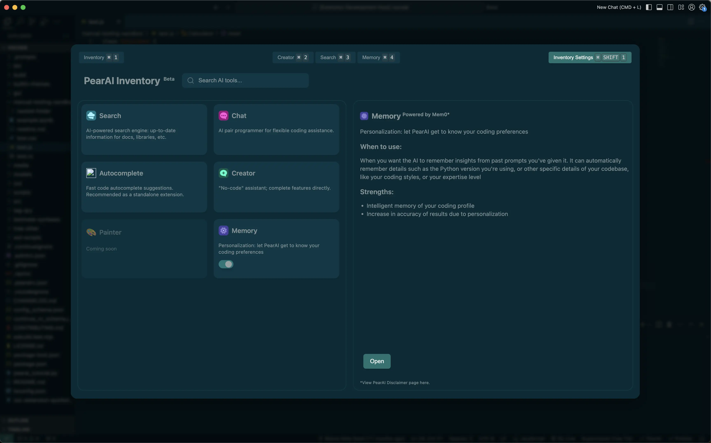
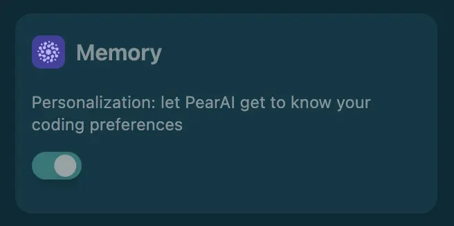
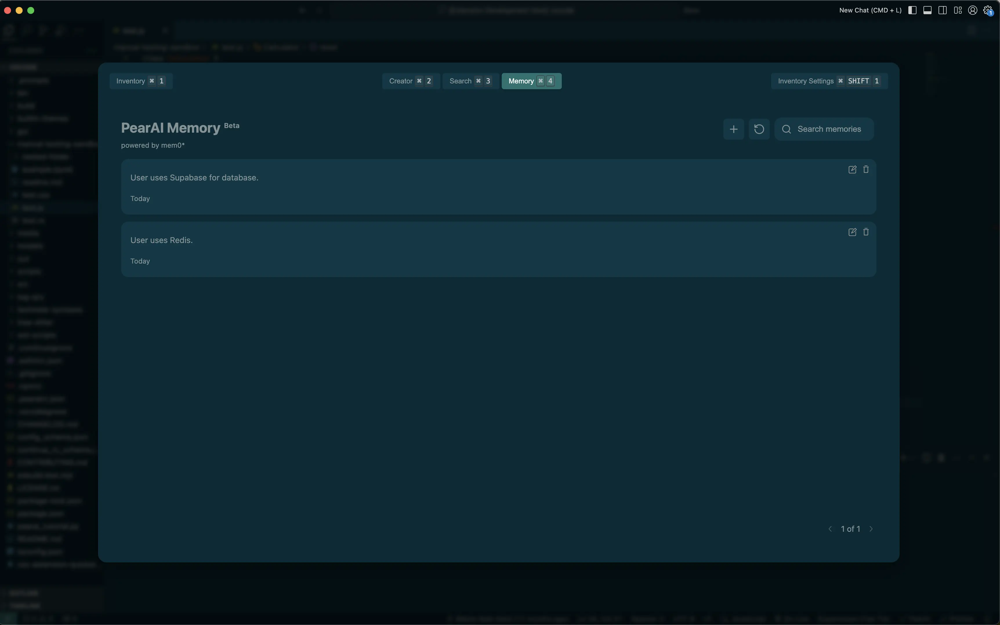

## What is PearAI Memory?
PearAI Memory adds a memory layer to your conversation with PearAI Chat. It can intelligently remember facts about you based on your prompt and LLM response. This allows PearAI to remember your coding preferences and codebase settings, enabling a more personalized and context-aware interaction persisted across sessions.

Memory is powered by Mem0, a self-improving memory layer, which adapts to and learns from your interactions with the LLM. It continuously updates memories associated to you over time as your project and/or coding style changes. Each of your projects will have its unique set of memories, keeping preferences tailored to each of them.

## How does it work?
PearAI Memory automatically learns from your chats and stores relevant information about your coding style and project settings. When you ask questions, AI is used to filter these stored memories and include any relevant context to provide personalized responses.

## How does it help me during coding?
A more personalized coding experience enabled by the memory layer can bring the following benefits:

1. **Personalized code suggestions**: The memory layer continuously learns from your coding patterns and preferences as well as project requirements, offering more relevant and tailored code completions over time.
2. **Project-specific context**: It retains information about your project's structure, dependencies, and coding conventions, enabling more accurate and consistent suggestions.
3. **Improved error detection**: By remembering common mistakes and their corrections, the memory layer can help identify and prevent recurring errors.
4. **Efficient code reuse**: It can recall and suggest previous solutions that are relevant to the current task, improving productivity.
5. **Cross-file context**: It can maintain context across multiple files in a project, providing more comprehensive and relevant suggestions when working on complex codebases.
6. **Customized documentation**: The memory layer can assist in the generation of personalized documentation based on the developer's coding practices and project-specific details.

## How do I use it?
1. Go to your inventory settings (CMD/CTRL + Shift + 1)
    

    

    

2. Locate the Memory card in the inventory, and flick the toggle to on.
    

    

    

3. You’re all set! PearAI Memory will now automatically get to know you as you interact with PearAI Chat. Note that memories are injected into your prompt and count towards credit usage. You can access the Memory control panel to add, edit, or delete memories (CMD/CTRL + 4).
    

    
    

    
