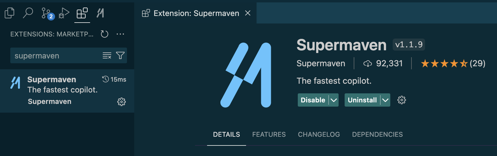

# ✅ Tab AutoComplete

PearAI supports tab autocomplete, which predicts and suggests what you would type next as you're coding. Here's how to set it up:

## Setup Guide


[Supermaven](https://supermaven.com/) is currently one of the best and fastest code autocomplete AI on the market, and provides a generous free tier. Simply install Supermaven directly as an extension within PearAI.

  

We are currently working on hosting our own model for code autocompletion. Stay tuned!

## Alternative

1. **Setup Codestral**

   We recommend using [Codestral](https://mistral.ai/news/codestral/), the leading model for code completion (or FIM — Fill In Middle). It's also open-sourced! You'll need to obtain a Codestral API key from [Mistral API](https://console.mistral.ai).

2. **Add to PearAI config.json**

   Add the following to your config.json file (replace "YOUR_API_KEY" with your actual API key):

   ```json
   "tabAutocompleteModel": {
     "title": "Codestral",
     "provider": "mistral",
     "model": "codestral-latest",
     "apiKey": "YOUR_API_KEY"
   }

   ```
3. **Enjoy the development speed up with autocomplete!**
